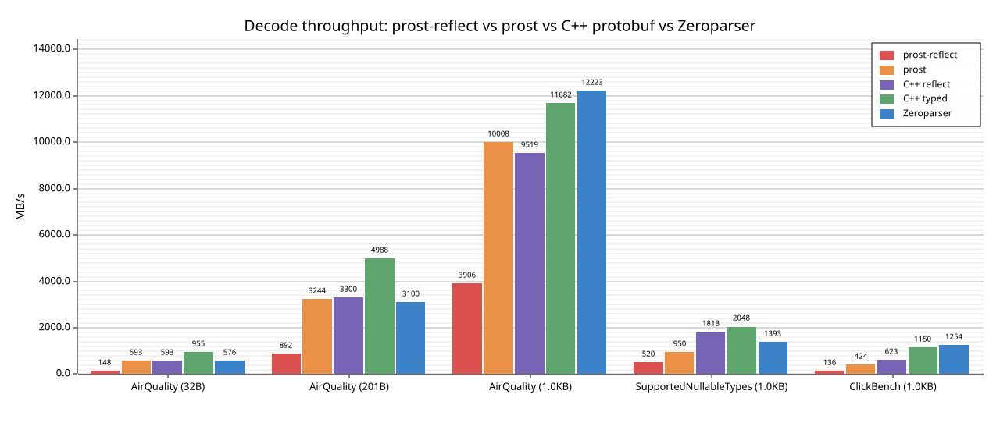

# Zeroparser

Zero-copy, single-pass protobuf parser driven by a `DescriptorProto`. Parses
nested messages in one O(N) traversal; all string and byte values borrow from
the input buffer.

## Why

`prost-reflect`'s `DynamicMessage` is convenient when you have a schema only at
runtime, but each decode allocates a tree of owned values. Zeroparser keeps the
same "schema known only at runtime" property while avoiding those allocations:
fields are stored in two pre-sized arrays indexed via a per-descriptor field
cache, and `&str`/`&[u8]` values point straight into the input.

## Benchmark

`cargo bench --bench bench_plot` writes `bench_plot.svg`:



Five decoders on the same bytes, each parsing and walking every field once
(the streaming-ingestion case — no field skipping). Three carry a
runtime-only schema (`prost-reflect`, C++ Reflection, Zeroparser); two are
compile-time-typed (`prost`, C++ generated accessors).

| Schema                 | Record size | prost-reflect | prost      | C++ reflect | C++ typed  | Zeroparser  |
| ---------------------- | ----------- | ------------- | ---------- | ----------- | ---------- | ----------- |
| AirQuality             | 32 B        | ~214 MB/s     | ~954 MB/s  | ~593 MB/s   | ~955 MB/s  | ~1010 MB/s  |
| AirQuality             | ~200 B      | ~1283 MB/s    | ~4942 MB/s | ~3300 MB/s  | ~4988 MB/s | ~5366 MB/s  |
| AirQuality             | 1 KB        | ~5438 MB/s    | ~13491 MB/s| ~9519 MB/s  | ~11682 MB/s| ~18686 MB/s |
| SupportedNullableTypes | 1 KB        | ~763 MB/s     | ~1618 MB/s | ~1813 MB/s  | ~2048 MB/s | ~2057 MB/s  |
| ClickBench             | 1 KB        | ~193 MB/s     | ~671 MB/s  | ~623 MB/s   | ~1150 MB/s | ~1771 MB/s  |

Vs runtime-schema peers, Zeroparser is 4–9x faster than `prost-reflect` and
1.1–2.8x faster than C++ Reflection. Vs compile-time-typed peers
(`prost`, C++ typed), it keeps pace on small messages and pulls ahead on
larger/wider ones — despite carrying a runtime descriptor that they don't.
The advantage widens with field count: ClickBench's 105 fields make
per-message overhead the bottleneck for reflection-based decoders, which is
where Zeroparser's pre-sized field cache and zero-copy `&str`/`&[u8]` layout
win most.

Each Rust measurement is averaged over 3 trials in-bench; C++ values are the
mean of 6 runs of an out-of-tree harness against libprotobuf 32.1 (see
`e2e/benches/README.md`).

Measured on: Apple M4 Max (16-core, arm64), 64 GB RAM, macOS 26.4.1, rustc
1.90.0, libprotobuf 32.1, clang++ from Apple Xcode.

## Quick start

Zeroparser is an internal sub-crate of the [Zerobus SDK](https://github.com/databricks/zerobus-sdk).

```rust
use prost_types::DescriptorProto;
use databricks_zerobus_ingest_sdk::zeroparser::{
    MessageRegistry, parser::ParsedMessage, types::FieldValueRef,
};

let descriptor: DescriptorProto = /* from a .proto file or reflection */;
let registry = MessageRegistry::from_descriptor(&descriptor);

let bytes: &[u8] = /* protobuf-encoded message */;
let parsed = ParsedMessage::parse(bytes, &registry)?;

if let Some(FieldValueRef::String(s)) = parsed.get_scalar(1) {
    println!("field 1 = {s}");
}
```

### API

| Method                             | Returns                                             |
| ---------------------------------- | --------------------------------------------------- |
| `has_field(field_num)`             | `bool`                                              |
| `get_scalar(field_num)`            | `Option<&FieldValueRef>`                            |
| `get_message(field_num)`           | `Option<&ParsedMessage>`                            |
| `get_repeated_scalars(field_num)`  | `&[FieldValueRef]`                                  |
| `get_repeated_messages(field_num)` | `&[ParsedMessage]`                                  |
| `get_map_entries(field_num)`       | `impl Iterator<Item=(&MapKeyRef, &ParsedMapValue)>` |
| `get_map_entries_count(field_num)` | `usize`                                             |

`FieldValueRef` is one of `String(&str)`, `Int32`, `Int64`, `UInt32`, `UInt64`,
`Bool`, `Float`, `Double`, `Bytes(&[u8])`. Enum fields parse as `Int32`.

## Architecture

```
input &[u8]
   |
   v
wire.rs          - varint / fixed / length-delimited field decoder
   |
   v
registry.rs      - DescriptorProto -> per-field cache
                   (field_type, is_scalar, is_repeated, storage_index,
                    oneof_index, ...)
   |
   v
parser.rs        - recursive single-pass parse into ParsedMessage:
                   scalars: Box<[Option<FieldValueRef>]>  (no enum wrapper)
                   complex: Box<[ComplexType]>
                            (Empty | Message | RepeatedScalar |
                             RepeatedMessage | Map)
```

Scalars use `Option<FieldValueRef>` directly to avoid an enum-discriminant
check on the hot path. Complex fields (nested messages, maps, repeated) use a
discriminated enum.

## Build & test

```bash
cargo build
cargo test --lib                   # 72 unit tests inside src/ (#[cfg(test)] modules)
cargo test --test e2e              # 97 integration tests in e2e/tests/e2e.rs
cargo test                         # everything: lib + integration + doc tests
cargo bench --bench parser_bench   # full criterion sweep
cargo bench --bench bench_plot     # produces bench_plot.svg
```

Requires `protoc` on `PATH` for the build script (used to compile the test and
bench `.proto` files). On Debian/Ubuntu: `apt install protobuf-compiler`.

## Layout

Crate is exported by the SDK as `databricks_zerobus_ingest_sdk::zeroparser`; (not published to crates.io).
`e2e/` is a workspace member that holds integration tests and benchmarks.

```
src/wire.rs                 — wire format, varint parsing, field decoding
src/registry.rs             — MessageRegistry, field descriptor caching
src/parser.rs               — single-pass recursive parser
src/types.rs                — FieldValueRef, ComplexType, conversions
src/errors.rs               — ParseError, ParseResult
src/sparse_field_map.rs     — O(1) per-descriptor field lookup
src/owned.rs                — owning wrapper

e2e/                        — workspace member, not published
  build.rs                  — compiles tests/proto and benches/proto via prost-build
  tests/e2e.rs              — integration tests
  benches/                  — criterion sweep + MB/s bar plot
```
